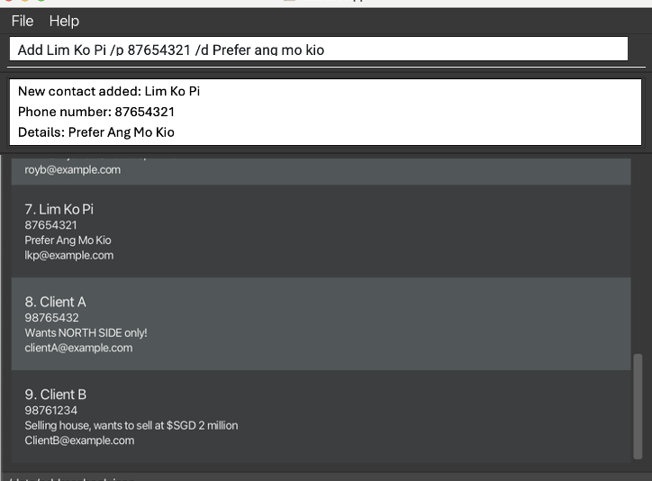

CLIentTracker is a desktop CRM designed for property agents who prefer working quickly from the command line while
still having a clean desktop interface.

## Installation

1. Ensure you have Java `17` or above installed on your computer. 
   **Mac users:** Ensure you have the precise JDK version prescribed [here](https://se-education.org/guides/tutorials/javaInstallationMac.html).

1. Download the latest `.jar` file from [here](https://github.com/se-edu/addressbook-level3/releases).

1. Copy the file to the folder you want to use as the _home folder_ for your CLIentTracker.

1. Open the folder where your CLIentTracker is currently located, double click to run CLIentTracker and a User Interface
   similar to the one below should appear in a few seconds with some sample data loaded. 
   

## Try It Out

1. Type commands into the command box and press Enter to execute them.

1. Try these example commands:

   * `list` to list all contacts
   * `add n/John Doe p/98765432 e/johnd@example.com a/John street, block 123, #01-01` to add a contact
   * `delete 3` to delete the 3rd displayed contact
   * `clear` to delete all contacts
   * `find n/John` to search for contacts by name
   * `exit` to close the application

1. Continue with the [User Guide](UserGuide.html) for full command details, or jump straight to the [Command Summary](UserGuide.html#command-summary).
